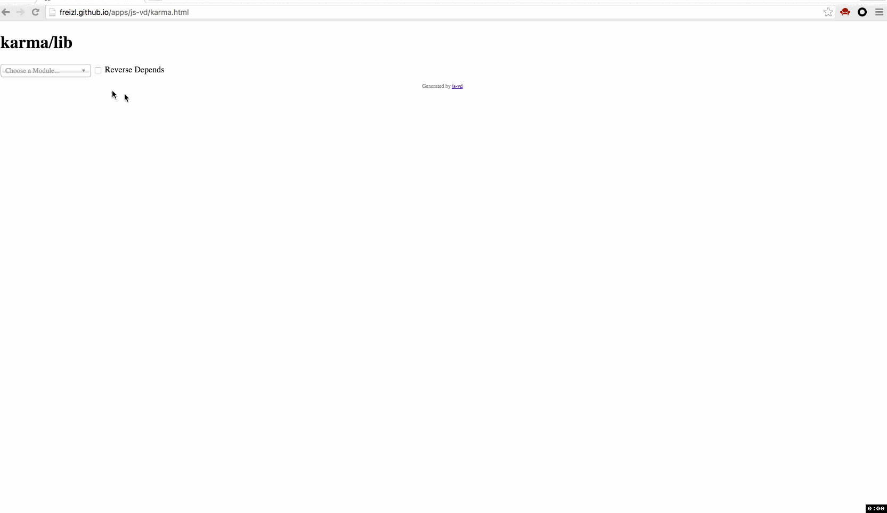

# js-vd

Visualize JavaScript source code dependency as an tree view.
All thanks to

- [madge](https://github.com/pahen/madge)
- [viz.js](https://github.com/mdaines/viz.js/)

## Getting Started

Install the module with: `npm install -g js-vd`

## Quick Demo

- 

## Examples

- http://freizl.github.io/apps/js-vd/index.html

Or generate for your own project

- `vd -f amd /path/to/project/source > index.html`
- `vd /path/to/express/project > index.html`
- `vd -f amd -d some/module/name /path/to/project/source > index.html`

then open the result html

## Options

Type `vd --help` or [view the source](https://github.com/freizl/js-vd/blob/master/bin/vd) for the many options like `--exclude` and `--dot`.

## Contributing
In lieu of a formal styleguide, take care to maintain the existing coding style. Add unit tests for any new or changed functionality. Lint and test your code using [Grunt](http://gruntjs.com/).

## License
Copyright (c) 2015-2016 Haisheng.Wu
Licensed under the MIT license.
